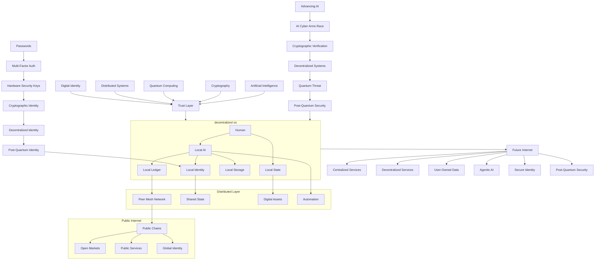

# Kyle Drake

> *Systems Engineer*

---

## IoT Evolution Convergence Map

---

  <em>githubs <a href="https://www.githubstatus.com/">official status page</a> no longer shows:</em>

  <em>latest CVE's</em>

  

| Vertical                              | Organization                    | Core Innovation                                                         | Status             |
|--------------------------------------------|-----------------------------------|-------------------------------------------------------------------------|--------------------|
| **Decentralized Identity & OS**                     | [FRAME](https://github.com/frameprotocol)                    | `Deterministic` `local first` `runtime` with `capability scoped execution`, `receipt chaining`, and fully `replayable state`                         | Prototype/Active Development |
| **OBD2 + LLM Vehicle Monitoring**                     | [Gauge OBD](https://github.com/gauge-obd)           | `Live OBD2 data` to Bluetooth dongle directly into an `AI` to deliver `plain English explanations`, `failure predictions`, and sleek `Markdown dashboards` in `real time`                         | Alpha/Active Development              |
| **AI System** | [NEURA](https://github.com/neura-asi) | `Policy driven`, `self correcting` `AI agent` with `tool orchestration`, `structured fact extraction`, `conflict detection`, `econciliation loops`, and `memory guided decision making` | Active Development |
| **CLI Harness** | [kcode](https://github.com/icedmoca/kcode) | `Local first` `AI coding harness` with `persistent memory`, `context virtualization`, `lossless retrieval backed compression`, `dynamic tool orchestration`, `local sidecar routing`, `semantic context paging`, and `tool grounded long session execution` | Release / Active Development |

> [!NOTE]
> Projects listed as **Experimental** are on hold..

| Vertical                              | Project Name                                                                 | Core Innovation                                                         | Status             |
|--------------------------------------|------------------------------------------------------------------------------|-------------------------------------------------------------------------|--------------------|
| **Custom Dialects for LLM's**         | [llm-interlang](https://github.com/icedmoca/llm-interlang)                   | Efficient LLM interaction / token optimization for multiagent systems  | Release            |
| **Model Tokenization**                | [ollama-vocab-tokenizer](https://github.com/icedmoca/ollama-vocab-tokenizer) | Fast model tokenization endpoints with vocab-only cache                 | Release            |
| **ChatGPT Lag Fixer**                 | [Trimwise Fork](https://github.com/icedmoca/Trimwise)                        | Improves ChatGPT performance with virtual scrolling                     | Release            |
| **Agentic Workflow Enabler**          | [ChatGPT Chrome Bridge](https://github.com/icedmoca/chatgpt_chrome_bridge)   | Automates ChatGPT via Chromium over SSH (no API key)                    | Release            |
| **MacOS Virtualization**              | [OSXVenturaDocker](https://github.com/icedmoca/OSXVenturaDocker)             | macOS Ventura on Windows 11 via WSL2, QEMU, Docker                      | Release            |
| **Browser Extension Utility**         | [404 Redirect](https://github.com/icedmoca/404-archive-redirect)             | Redirects 404 pages to archive sources                                  | Release            |
| **Hypervisor Control Panel**          | [hyperv-ascii-orchestrator](https://github.com/icedmoca/hyperv-ascii-orchestrator) | Local HyperV dashboard with no cloud dependencies                       | Release            |
| **Cognitive Architecture Simulation**                 | [drol](https://github.com/neura-asi/drol)                            | Deterministic Reasoning Optimization Layer             | Release           |
| **Neuro Symbolic AI**                 | [MeRNSTA](https://github.com/icedmoca/MeRNSTA)                               | Dynamic contradiction suppression via causal graph analysis             | Research           |
| **Cryptography**                      | [SHA256-90R](https://github.com/icedmoca/SHA256-90R)                         | Extended AES/SHA variants with additional rounds                        | Experimental       |
| **Quantum Computing**                 | [qSHA256](https://github.com/icedmoca/qSHA256)                               | Quantum SHA-256 implementation using Qiskit                             | Experimental       |
| **Metadata Resistant Tunneling**      | [SignalTunnel](https://github.com/icedmoca/SignalTunnel)                     | TCP/UDP tunneling over Signal protocol                                  | Experimental       |
| **Security Sensor Fusion**            | [Security Obelisk](https://github.com/icedmoca/security-obelisk)             | Cameras SLAM + Wi-Fi localization fusion system                         | Experimental       |
| **Car Computing Platform**            | [Road Arch](https://github.com/malibuw/roadarch)                             | Vehicle dashboard with SDR, OBD, DSP, camera, GPS integration           | Experimental       |
| **Negentropy Backed Blockchain**      | [Entropy Ledger (ENL)](https://github.com/Entropy-Ledger-ENL)                | Quantum ledger using negentropy consensus                               | Experimental       |
| **OSINT Data Gathering**              | [XKeystroke](https://github.com/AIOSINT/Xkeystroke)                          | Web scraping + API-driven intelligence gathering                        | Prototype          |
